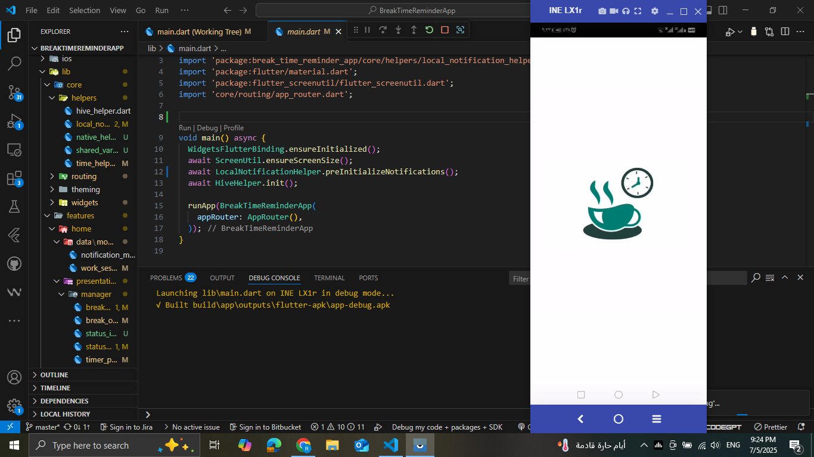
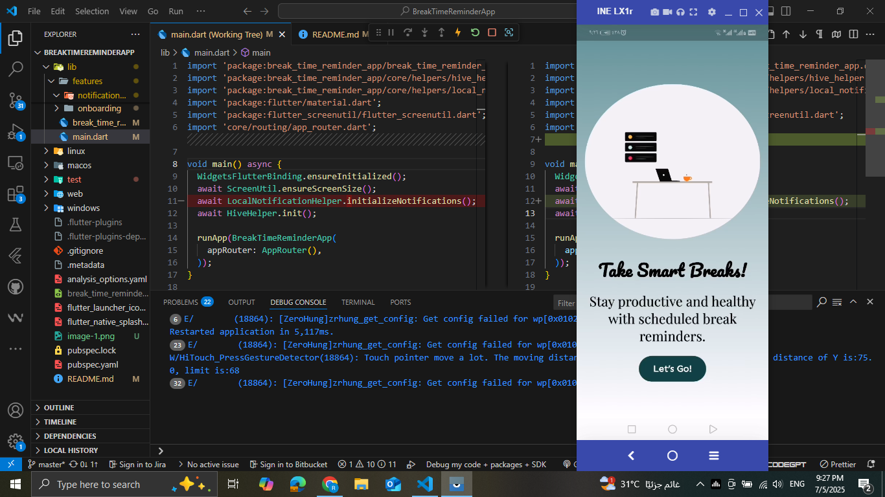
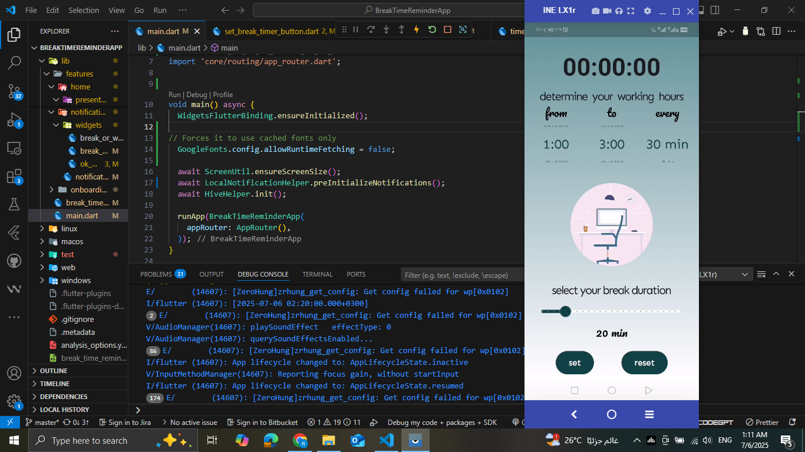

# break_time_reminder_app

A mobile application that enhances productivity by notifying users to take scheduled breaks. It ensures state persistence, dynamic time zone support, and seamless user experience with accurate timers and local notifications

- Target Audience:
Office workers - Students - Remote employees 

- Features & UI Screens

. Splash Screen : contains app logo

. Onboarding Screens : contains informative expressions on how app is useful

. Main Screen

Choose break intervals (e.g., every 30 minutes, 1 hour)

Choose start and end working times 

set button to start timer and reset button to reset it 

Displays screen when either break time is come or work time is come

